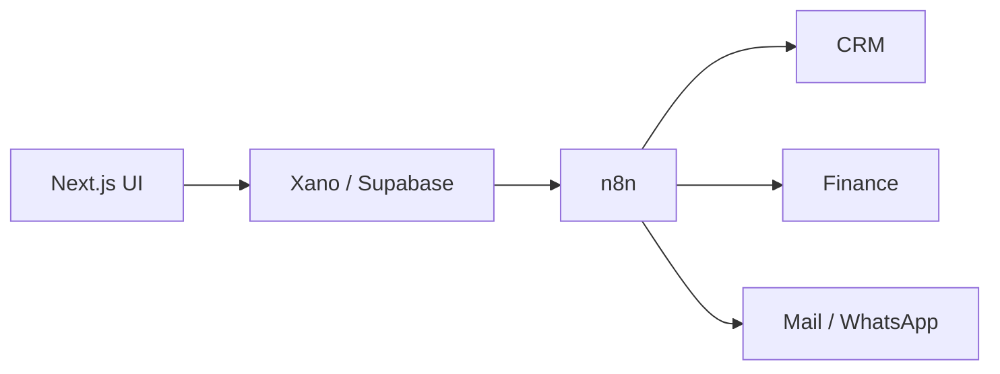

<p align="left">
  
</p>

# kobe priam bantes
### /koh-beh/ · frontend-first, systems-fluent

I design the interface, then I own everything behind it.  
Lead software engineer in the **Netherlands**. CTO in **Belgium**.  
I ship web products that look sharp and the workflows that keep them alive after launch.

<br />

| 🇳🇱 Netherlands | 🇧🇪 Belgium |
| :---: | :---: |
| **Lead Software Engineer** | **Chief Technology Officer** |
| [Triplebird](https://triplebird.nl) | [Sitesfied](https://www.sitesfied.com) |
| AI agents, ops platforms, n8n systems for Dutch SMEs | Product, apps, and the engineering bar for a Belgian studio |

<br />

## what I actually build

Not demo to-do apps. Production software for real businesses.

```
leads in ──► Next.js product ──► Xano / Supabase ──► n8n ──► CRM · finance · mail · WhatsApp
                 ▲                                         │
                 └──────────── the part people touch ───────┘
```

- **Product apps** — CRMs, academies, invoicing, admin tools, client portals
- **Brand & conversion sites** — construction, restaurants, education, mobility
- **Automation systems** — n8n (and Make) that turn forms, inboxes, and invoices into pipelines
- **Internal OS** — the unsexy dashboards companies run on every day

Recent worlds I work in: finance ops, field service, construction, solar, education.

<br />

## the stack I reach for

<p>
  
</p>

| I write | I ship with | I specialize in |
| --- | --- | --- |
| **TypeScript** · JavaScript | **Next.js** · React · Tailwind · shadcn | **n8n** — agents, webhooks, messy real-world flows |
| Clean UI, not just components | **Xano** · **Supabase** · Stripe | **Make** when the client already lives there |
| Accessible, fast, Dutch/EN/FR ready | Vercel · App Store · Play Store | Turning a form into a company process |

Frontend is home. Automation is the unfair advantage.  
Most “full stack” stops at the API. I keep going until the lead is booked, the invoice is booked, or the team gets a Slack ping.

<br />

## currently

```ts
const kobe = {
  nl: "Lead Software Engineer @ Triplebird — AI + automation products",
  be: "CTO @ Sitesfied — websites, apps, payments, shipping to stores",
  building: ["ops platforms", "lead engines", "finance agents", "brand sites"],
  languages: ["TypeScript", "JavaScript"],
  obsessedWith: "n8n graphs that replace a whole back-office",
};
```

<br />

## a normal week



That graph is the job. Pretty screens on the left. Quiet systems on the right.

<br />

<p align="center">
  <picture>
    <source media="(prefers-color-scheme: dark)" srcset="https://raw.githubusercontent.com/kkoobe11/kkoobe11/output/github-contribution-grid-snake-dark.svg" />
    <source media="(prefers-color-scheme: light)" srcset="https://raw.githubusercontent.com/kkoobe11/kkoobe11/output/github-contribution-grid-snake.svg" />
    
  </picture>
</p>

<p align="center">
  <sub>contribution snake via <a href="https://github.com/Platane/snk">Platane/snk</a></sub>
</p>

<br />

<p align="center">
  <a href="https://www.linkedin.com/in/kobe-priam-bantes">LinkedIn</a>
  ·
  <a href="https://triplebird.nl">Triplebird</a>
  ·
  <a href="https://www.sitesfied.com">Sitesfied</a>
  ·
  <a href="https://www.kobebantes.me">kobebantes.me</a>
</p>
